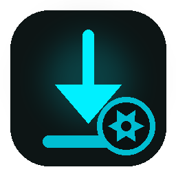
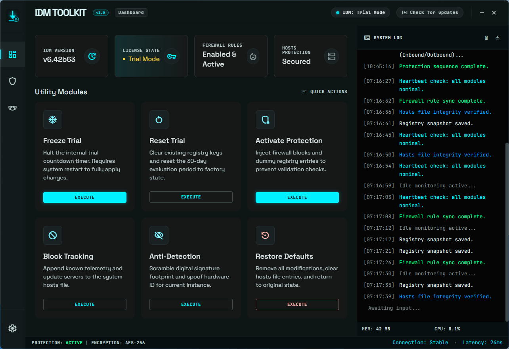

# IDM Toolkit

<p align="center">
  
</p>

<p align="center">
  A lightweight, modern utility for managing and maintaining your Internet Download Manager configuration.
  <br />
  Built with a beautiful dark-teal interface and real-time terminal feedback.
</p>

<p align="center">
  
  
  
  
</p>

---



---

## Features

- **Registry Backup** — Export a timestamped `.reg` snapshot of your IDM configuration at any time. Restore it later if anything goes wrong.
- **Network Protection** — Manage IDM-related entries in your system hosts file and configure firewall rules to control outbound connections.
- **Registry Cleanup** — Remove leftover IDM registry traces and restore a clean default state.
- **Real-time Terminal** — Every operation streams live output directly into the app's built-in terminal panel.
- **System Tray** — Minimizes to the system tray. Runs silently in the background and restores instantly.
- **Auto-update Check** — The app checks for new versions on startup and notifies you when one is available.

> **For educational and research purposes only.**
> This tool is intended to help users understand how Windows registry-based software configurations work.

---

## Tech Stack

| Layer | Technology |
|---|---|
| Desktop wrapper | Python 3 · pywebview (Edge WebView2) |
| UI | HTML · Tailwind CSS · Vanilla JS |
| Backend engine | Windows Batch Script |
| Installer | Inno Setup 6 |
| Landing page | Next.js 14 · TypeScript · Tailwind CSS |
| Hosting | Vercel |

---

## Building from Source

### Prerequisites

- Python 3.10+
- Node.js 18+ (for the landing page only)
- [Inno Setup 6](https://jrsoftware.org/isinfo.php) (for the installer)

### Desktop App

```bat
build.bat
```

This will:
1. Install Python dependencies (`pywebview`, `pyinstaller`)
2. Bundle everything into `dist\IDM Toolkit\IDM Toolkit.exe` via PyInstaller
3. Copy runtime assets into the dist folder

### Installer

Open `installer.iss` in Inno Setup Compiler and click **Build → Compile**.
Output: `IDM_Toolkit/public/IDM_Toolkit_v1.0.exe`

### Landing Page

```bash
cd IDM_Toolkit
npm install
npm run dev
```

---

## Project Structure

```
IDM Toolkit/
├── IDM Toolkit GUI.py       # Python/pywebview desktop wrapper
├── IDM Toolkit UI.html      # Main app interface (HTML + Tailwind)
├── idm_engine.cmd           # Batch script backend engine
├── build.bat                # PyInstaller build script
├── installer.iss            # Inno Setup installer script
├── app_icon.ico             # App icon (Windows)
├── app_icon.png             # App icon (PNG, used in UI + tray)
└── IDM_Toolkit/             # Next.js landing page
    ├── app/
    │   └── page.tsx
    └── public/
        ├── version.json
        └── Screenshot.png
```

---

## License

MIT License — free to use, modify, and distribute.

---

© 2026 Karim Antar · [karims.dev](https://karims.dev)
